  

 

## About

결제, 티켓팅, 보안 진단 서비스를 만들면서 **상태 전이와 예외 상황을 끝까지 검증하는 습관**을 길렀습니다.
기능이 동작하는 데서 멈추지 않고, 부하테스트와 로그로 "정말 맞는지"를 증명하는 백엔드 개발을 지향합니다.

- 한국교통대학교 데이터사이언스 전공 (2020.03 ~ 2026.02)
- 정보처리기사 · SQL 개발자(SQLD) · 데이터분석 준전문가(ADSP)
- 연락처: [wlgh5148@naver.com](mailto:wlgh5148@naver.com)

 

## Tech Stack

  
  
  
  
  
  
  
  
  
  
  
  
  
  
  
  
  
  
  
  
  

 

## Projects

| 프로젝트 | 설명 | 주요 기술 | 링크 |
| --- | --- | --- | --- |
| **PickSeat** | 콘서트 티켓팅 MSA 서비스 (개인) 모놀리스를 6개 서비스로 분리하며 오버셀 0건 유지 | Java, Spring Boot, Redis, nginx, k6 | [GitHub](https://github.com/hongjiho5148/ticketing-service) |
| **가상계좌 결제 시스템** (SafePay-Vault) | 가상계좌 발급 → 입금대기 → 승인 → 만료 결제 상태 전이와 입금 검증 시뮬레이터 (5인) | Java, Spring Boot, JPA, MySQL, Redis | [GitHub](https://github.com/hongjiho5148/miniproject3) |
| **MATE** | 팀 프로젝트 매칭 플랫폼, 인증과 소프트 삭제 정책 등 백엔드 담당 (6인) | Java, Spring Boot, JPA, QueryDSL, JWT | [Backend](https://github.com/hongjiho5148/miniproject2-backend) · [Frontend](https://github.com/hongjiho5148/miniproject2-front) |
| **ARGUS** | 웹 취약점 자동 진단 플랫폼, 진단 → 증거 캡처 → 리포트 자동화 (7인, 교육과정 대상) | Python, FastAPI, Playwright | [GitHub](https://github.com/hongjiho5148/ARGUS_Merge) |
| **편의점 행사 통합 대시보드** | CU, GS25, 7-Eleven, emart24 행사 상품을 수집·정제해 가격을 비교하고, 예산에 맞는 상품 조합을 추천 (6인) | Python, Streamlit, Pandas, BeautifulSoup4 | [GitHub](https://github.com/hongjiho5148/python_conv_project) |

 

## Highlights

- **PickSeat**: 부하테스트 실패율 24% → 0.05%, 예약 API p95 122ms → 139ms(서비스 분리 비용 검증), 설계 결함으로 영구 매진이던 5460석 중 1003석 복구
- **가상계좌 결제 시스템**: 동시 요청의 이중 처리를 낙관적 락으로 방지, 데드락까지 `ConcurrencyFailureException` 기준으로 묶어 일관되게 409로 응답
- **MATE**: 벌크 연산 후 detached 엔티티로 변경이 반영되지 않던 문제, 소프트 삭제 필터와 DB UNIQUE 제약의 검사 범위 불일치 문제 해결
- **ARGUS**: XSS/CSRF 진단 · 증거 캡처 · 리포트 생성을 하나의 파이프라인으로 단독 구현
- **편의점 행사 통합 대시보드**: 브랜드마다 다른 가격 표기를 정규식으로 정제해 하나의 스키마로 통일하고, 행사 유형(1+1, 2+1)별 실지불금액을 반영한 예산 기반 상품 조합 추천 로직 구현

 

## Contact

